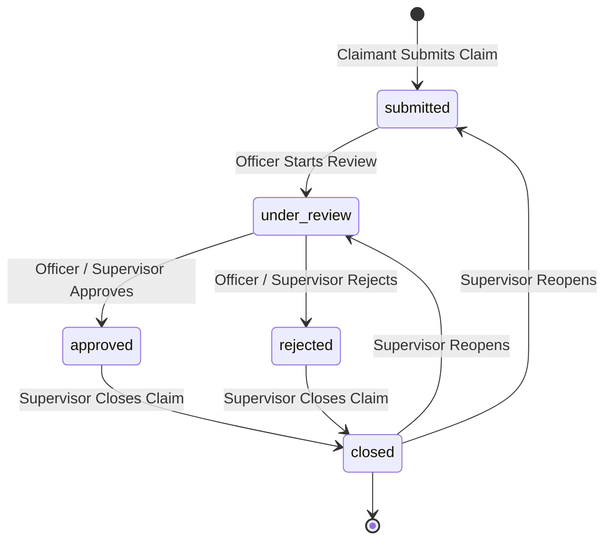

# ClaimDesk — AV Insurance Claim Intake & Lifecycle Tracker

> Insurance claim intake, automated ML triaging, and approval platform.

[](https://www.typescriptlang.org/)
[](https://react.dev/)
[](https://expressjs.com/)
[](https://www.sqlite.org/)
[](https://tailwindcss.com/)
[](LICENSE)

ClaimDesk is an enterprise-grade digital insurance claim intake, triaging, and lifecycle tracking platform built for **AV Insurance**. It automates claim submission for automobile (four-wheelers and two-wheelers) and health policies, applies strict role-based access control (RBAC), enforces state-machine-driven status transitions, and integrates live foreign exchange reference rates via an external API.

---

## 1. Problem Statement

Traditional insurance claim processing is hindered by fragmented communication, manual data entry errors, lack of claim ownership isolation, and opaque status updates for policyholders. Furthermore, insurance adjusters frequently struggle with untracked document handoffs, inconsistent vehicle detail verification, and absence of an authoritative, immutable audit trail.

---

## 2. Objective

ClaimDesk solves these challenges by providing:
- An **adaptive, policy-aware intake interface** that auto-populates verified vehicle specifications (maker, model, year, registration, and chassis number / VIN) for automobile policies and dynamically differentiates between cars (🚗) and bikes (🏍️).
- A **deterministic, role-governed workflow state machine** where status changes are restricted to authorized actors (`officer`, `supervisor`) with full history preservation.
- **Strict claim isolation** ensuring claimants can only access their own submissions and unassigned officers cannot manipulate pending records.
- An **external currency conversion engine** (Frankfurter API) providing real-time financial payout reference rates across global currencies.
- A **complete immutable audit trail** and event timeline logging every submission, transition, note creation, and administrative override.

---

## 3. Architecture & Tech Stack

```
                                  ┌────────────────────────┐
                                  │   React 18 + Vite UI   │
                                  │   (Tailwind CSS +      │
                                  │   TanStack Query)      │
                                  └───────────┬────────────┘
                                              │ HTTP / JSON
                                              ▼
                                  ┌────────────────────────┐
                                  │  Express + TypeScript  │
                                  │      REST API          │
                                  └─────┬──────────────┬───┘
                                        │              │
                   ┌────────────────────┴──┐        ┌──┴─────────────────────┐
                   ▼                       ▼        ▼                        ▼
        ┌─────────────────────┐  ┌──────────────┐ ┌────────────────────────┐ ┌──────────────────────┐
        │  SQLite / PostgreSQL│  │ Multer File  │ │ Frankfurter FX API     │ │ Local ML Microservice│
        │  Relational Storage │  │ Storage      │ │ (Live Currency Rates)  │ │ (FastAPI + XGBoost)  │
        └─────────────────────┘  └──────────────┘ └────────────────────────┘ └──────────────────────┘
```

- **Frontend**: React 18, Vite, TypeScript, Tailwind CSS, TanStack React Query, React Hook Form, Lucide React Icons.
- **Backend**: Node.js, Express, TypeScript, Zod Schema Validation, Helmet, CORS, Express-Rate-Limit, BCrypt, JSON Web Tokens (JWT).
- **Database**: SQLite3 / PostgreSQL with foreign key enforcement (`PRAGMA foreign_keys = ON`), automated sequence triggers, and indexed queries.
- **External Integration**: Frankfurter FX Public API (`https://api.frankfurter.app`) with identity pair handling and timeout protection.

---

## 4. User Roles & Permissions

| Role | Permissions & Responsibilities |
|---|---|
| **Claimant** | File new claims, auto-fill policy details, attach photos/PDFs (up to 10MB), edit submitted claims, view own claims, inspect status timeline and activity history. Isolated from other policyholders. |
| **Officer** | Workstation dashboard, view assigned claims, search and filter claims, start review (`submitted` ➔ `under_review`), approve or reject claims with recorded rationale, add private internal notes. |
| **Supervisor** | Global oversight over all claims and officers, review status, approve/reject, execute final claim closure (`approved`/`rejected` ➔ `closed`), reopen closed claims for further review (`closed` ➔ `under_review` or `submitted`), inspect system-wide audit logs. |

---

## 5. Workflow State Machine

ClaimDesk enforces a formal deterministic state machine for claim status transitions:



### State Transition Matrix

| Current Status | Next Status | Allowed Roles | Enforced Rule |
|---|---|---|---|
| `submitted` | `under_review` | `officer`, `supervisor` | Officer must be assigned to claim |
| `under_review` | `approved` | `officer`, `supervisor` | Decision rationale optional but recorded in event history |
| `under_review` | `rejected` | `officer`, `supervisor` | Rejection recorded with audit logging |
| `approved` | `closed` | `supervisor` | Only supervisors can close settled files |
| `rejected` | `closed` | `supervisor` | Archival closure executed by supervisor |
| `closed` | `under_review` | `supervisor` | Supervisor override to re-examine evidence |
| `closed` | `submitted` | `supervisor` | Supervisor resets claim back to intake queue |

---

## 6. Database Schema & Entities

The platform uses 6 core relational entities:

```
┌──────────────┐        ┌──────────────┐        ┌──────────────────┐
│    users     │◄───────┤    claims    ├───────►│  policies_mock   │
└──────┬───────┘        └──────┬───────┘        └──────────────────┘
       │                       │
       │                       ├───────────────►┌──────────────────┐
       │                       │                │   claim_events   │
       │                       │                └──────────────────┘
       ▼                       ▼
┌──────────────┐        ┌──────────────┐
│  audit_logs  │        │officer_notes │
└──────────────┘        └──────────────┘
```

1. **`users`**: `id` (UUID), `email` (UNIQUE), `password_hash`, `role` (`claimant` | `officer` | `supervisor`), `full_name`, `created_at`, `updated_at`.
2. **`policies_mock`**: `id`, `policy_number` (UNIQUE), `type` (`automobile` | `health`), `holder_name`, `coverage_amount`, `currency`, `is_active`, `vehicle_category` (`car` | `bike`), `vehicle_make`, `vehicle_model`, `vehicle_year`, `vehicle_reg_number`, `chassis_number`.
3. **`claims`**: `id`, `claim_number` (`AV-CLAIM-YYYYMMDD-XXXX`), `claimant_id` (FK), `policy_id` (FK), `assigned_officer_id` (FK), `title`, `description`, `incident_date`, `claim_amount`, `currency`, `status`, `incident_type`, `vehicle_category`, `vehicle_make`, `vehicle_model`, `vehicle_year`, `vehicle_reg_number`, `chassis_number`, `damage_description`, `treatment_type`, `hospital_name`, `diagnosis`, `treating_doctor`, `admission_date`, `discharge_date`, `injury_severity`, `document_paths` (JSON), `priority_label`, `priority_score`, `priority_reason` (JSON), `created_at`, `updated_at`.
4. **`claim_events`**: `id`, `claim_id` (FK), `actor_id` (FK), `previous_status`, `new_status`, `reason`, `created_at`.
5. **`officer_notes`**: `id`, `claim_id` (FK), `author_id` (FK), `content`, `created_at`.
6. **`audit_logs`**: `id`, `actor_id` (FK), `action`, `resource_type`, `resource_id`, `metadata` (JSON), `ip_address`, `created_at`.

---

## 7. REST API Endpoints

### Authentication & Sessions
- `POST /auth/register` — Register a new claimant or officer (`{ email, password, role, full_name }`)
- `POST /auth/login` — Authenticate and receive signed JWT (`{ email, password }`)
- `GET /auth/me` — Verify active token and restore session profile
- `POST /auth/logout` — Invalidate client-side session

### Policies
- `GET /policies?search={query}` — Search policies by policy number or holder name (returns auto-fill vehicle data)
- `GET /policies/:id` — Retrieve policy record by ID or Policy Number

### Claims Management
- `GET /claims` — List claims (Claimant: own claims; Officer: assigned claims; Supervisor: all claims)
- `GET /claims/:id` — Retrieve claim details with joined policyholder information
- `POST /claims` — Submit new claim with optional multipart file uploads (Claimant only)
- `PATCH /claims/:id` — Update claim fields (allowed only while status is `submitted`)
- `DELETE /claims/:id` — Delete claim (allowed only while status is `submitted`)
- `PATCH /claims/:id/status` — Execute state transition (`{ status, reason }`, Officer/Supervisor only)

### Notes & Events
- `GET /claims/:id/notes` — Fetch private notes (Officer/Supervisor only)
- `POST /claims/:id/notes` — Add internal officer note (Officer/Supervisor only)
- `GET /claims/:id/events` — Retrieve chronological status history timeline

### Audit & Observability
- `GET /audit` — Filter audit logs by resource or action (Supervisor/Officer)
- `GET /audit/claim/:id` — Inspect complete audit history for a specific claim

### External FX & System Health
- `GET /fx/convert?base={base}&target={target}&amount={amount}` — Real-time currency conversion
- `GET /health` — Health check endpoint verifying backend and database connectivity

---

## 8. Seed Accounts & Demo Policies

### Demo Accounts (`Password: Demo1234!`)

| Name | Role | Email | Purpose |
|---|---|---|---|
| **Alice Brown** | Claimant | `alice@demo.com` | File claims, view timeline, inspect payouts |
| **Bob Martinez** | Officer | `bob@demo.com` | Primary claims adjuster, reviews & approvals |
| **Carol Singh** | Officer | `carol@demo.com` | Secondary officer (used for assignment isolation checks) |
| **Dave Thompson** | Supervisor | `dave@demo.com` | Executive oversight, closure, and reopen permissions |

### Demo Policies

| Policy Number | Type | Category | Vehicle / Coverage | Reg Number | Chassis Number |
|---|---|---|---|---|---|
| `AV-AUTO-00101` | Automobile | 🚗 **Car** | 2022 Toyota Camry | `KA-01-AB-1234` | `AVTY984723948201` |
| `AV-AUTO-00102` | Automobile | 🚗 **Car** | 2023 Ford Transit | `MH-02-CD-5678` | `AVFD839201948572` |
| `AV-AUTO-00103` | Automobile | 🏍️ **Bike** | 2023 Yamaha YZF-R3 | `DL-03-EF-9012` | `AVYM482910385721` |
| `AV-AUTO-00104` | Automobile | 🏍️ **Bike** | 2022 Royal Enfield Classic 350 | `KA-05-GH-3456` | `AVRE739201847582` |
| `AV-HLTH-00201` | Health | 🏥 **Health** | $100,000 Hospitalization Coverage | N/A | N/A |

---

## 9. Quick Start & Installation

### Prerequisites
- Node.js 18+ (tested on Node v20/v22)
- npm 9+

### 1. Database Initialization
```bash
cd backend
node setup_sqlite.js
```

### 2. Start Backend Server
```bash
npm install
npm run dev
# Running on http://localhost:4000
```

### 3. Start Frontend Client
```bash
cd ../frontend
npm install
npm run dev
# Running on http://localhost:5173
```

---

## 10. Automated Testing

ClaimDesk includes an automated regression test suite covering all 12 operational domains (62 assertions):

```bash
cd backend
npm test
```

Test coverage includes:
- Health check liveness (`GET /health`)
- Authentication regression (login, wrong password, token forgery, duplicate signup)
- Role-based authorization & negative permissions
- Policy search & vehicle auto-fill verification
- Claim CRUD & auto-generated identifiers
- Cross-tenant claim isolation
- Officer assignment restrictions
- Valid & invalid state transitions
- Internal notes & claimant access restrictions
- Event timelines & audit log recording
- Live external Frankfurter FX conversion & identity pair handling

---

## 11. Production Deployment Guide

ClaimDesk can be deployed to production using zero-cost container or PaaS environments:

### Environment Configuration

#### Backend (`backend/.env`):
```env
PORT=4000
NODE_ENV=production
DATABASE_URL=sqlite:///app/database/claimdesk.sqlite
JWT_SECRET=super_secret_production_key_claimdesk_2026_xyz
CORS_ORIGIN=https://claimdesk.yourdomain.com
ML_SERVICE_URL=http://localhost:8000
```

#### Frontend (`frontend/.env`):
```env
VITE_API_URL=https://api.claimdesk.yourdomain.com
```

### Health Check Verification
```bash
curl -i https://api.claimdesk.yourdomain.com/health
# Returns HTTP 200: {"success":true,"status":"ok","message":"Backend is healthy"}
```

---

## 12. Complete 17-Step Demonstration Flow

1. **Landing Page**: Navigate to `http://localhost:5173`. Review hero banner and features.
2. **Claimant Login**: Click "1-Click Demo Login: Claimant" (`alice@demo.com` / `Demo1234!`).
3. **Start New Claim**: Click "File New Claim".
4. **Policy Auto-Fill**: Click the quick-select chip for **Bike (Yamaha R3)** (`AV-AUTO-00103`). Observe the purple badge (`🏍️ Two-Wheeler / Bike`) and auto-filled Maker, Model, Year, Registration, and Chassis Number.
5. **Submit Claim**: Enter incident description, estimated claim amount ($850), and click "Submit Claim".
6. **Show Saved Claim**: Observe instant redirect to `/claims/:id`. Verify claim number `AV-CLAIM-YYYYMMDD-XXXX` and vehicle specs.
7. **Show Status Timeline**: Verify the initial step `Submitted` is marked complete in the visual progression bar.
8. **Officer Login**: Click "Logout", then click "1-Click Demo Login: Officer" (`bob@demo.com` / `Demo1234!`).
9. **Officer Dashboard**: View the dynamic KPI cards (Total Assigned, Submitted, Under Review, Approved, Rejected). Test in-place search and status filters.
10. **Open Claim**: Click "Review" on Alice's submitted claim.
11. **Add Internal Note**: In the "Officer Notes" section, enter: *"Verified damage estimate with authorized service center."* and click Send.
12. **Start Review**: In the Action panel, click **Start Review**. Observe claim status transition to `UNDER REVIEW`.
13. **Approve Claim**: Enter decision reasoning and click **Approve Claim**. Status updates to `APPROVED`.
14. **Inspect FX Widget**: Scroll to the Financial Summary card. Toggle currency to EUR or INR to demonstrate live Frankfurter FX conversion.
15. **Supervisor Login**: Logout and log in as Supervisor (`dave@demo.com` / `Demo1234!`).
16. **Close Claim**: Open the approved claim as supervisor and click **Close Claim**. Status transitions to `CLOSED`.
17. **Show Audit Trail**: View the "Audit Trail & Verified History" card. Confirm every action (`claim_created`, `status_changed`, `note_created`) is immutably recorded with actor identity and timestamps.
>>>>>>> eccfe16 (checkpoint: aave glass design complete, floating stepper fixed - before OOP abstraction rebuild)
